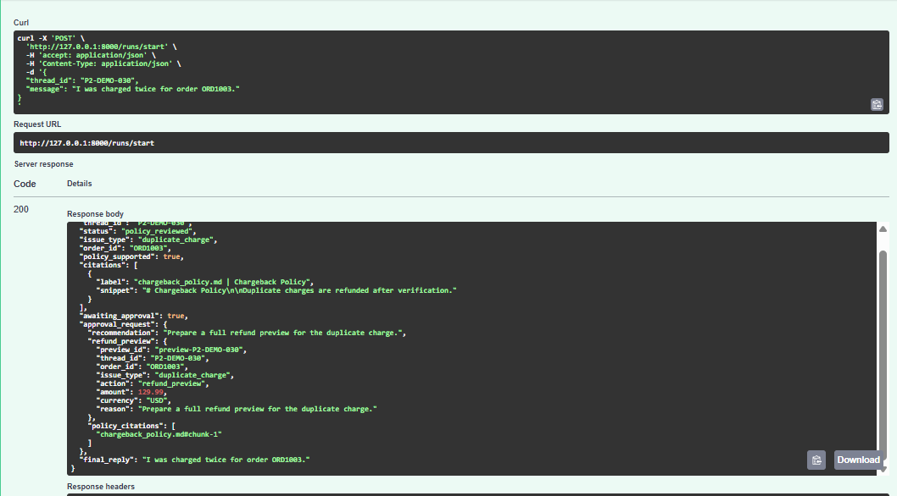
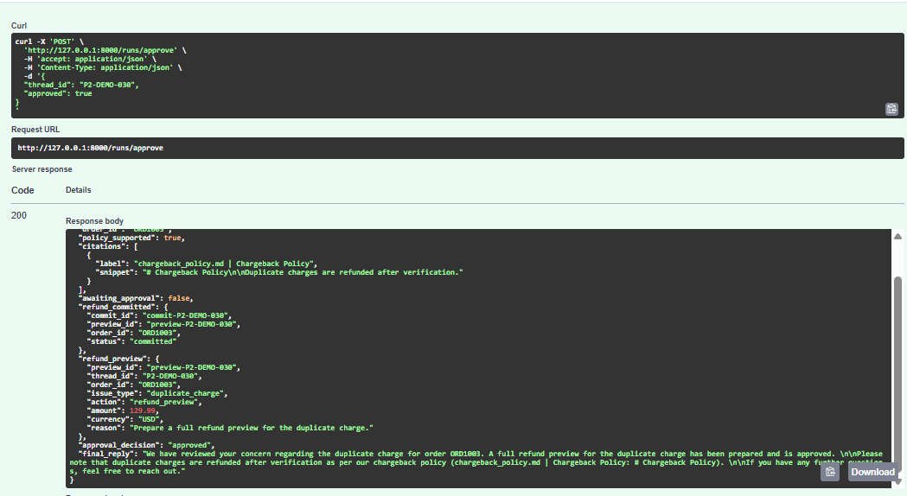
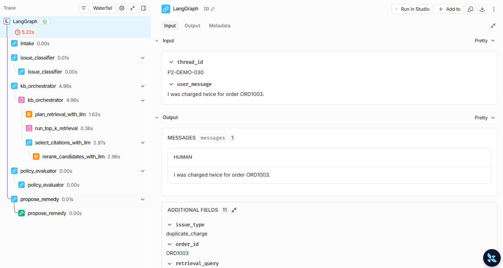
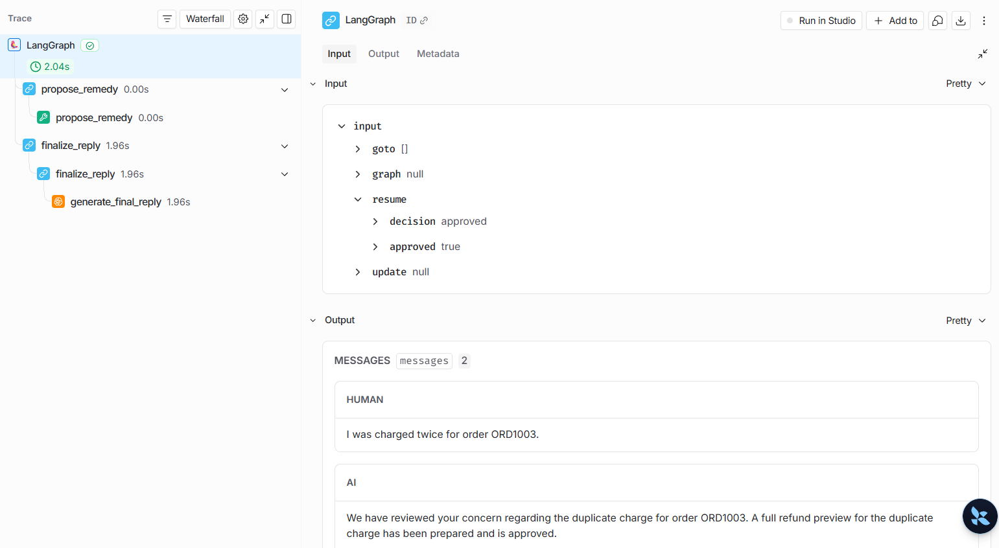

# Phase 2 — Public

# Phase 2: HR Interview Task with Agentic RAG

This project implements a customer-support triage agent using **FastAPI + LangGraph** with:

- durable checkpoint persistence using **Postgres**
- a human approval gate using **LangGraph interrupts**
- a local policy knowledge base indexed in **ChromaDB**
- an **agentic RAG** flow where an LLM plans retrieval and selects supporting citations
- final customer-facing replies generated by the **LLM**

## High-Level Flow

The agent is built as a LangGraph workflow. Each request is tied to a durable `thread_id`, so execution can pause, persist, and resume later.

Graph flow:

```text
START
  -> intake
  -> issue_classifier
  -> kb_orchestrator
  -> policy_evaluator
  -> propose_remedy
  -> finalize_reply
END
```

****Node-by-Node Explanation****
**1. intake**
Purpose: Initialize the run state with the incoming user message.

How it works: Deterministic

This node:

stores the user message in graph state
initializes message history
marks the run as received
Why deterministic:
This is just state setup. No reasoning is needed.

**2. issue_classifier**
Purpose: Detect the issue type and extract the order ID.

How it works: Deterministic

This node:

classifies the issue into types such as:
duplicate_charge
late_delivery
warranty
missing_item
refund_request
extracts ORD... values using regex
Why deterministic:
This was kept rule-based for reliability and speed in the demo. The classification logic is explicit and easy to inspect.

***3. kb_orchestrator***
Purpose: Run the retrieval planning and citation selection workflow for policy grounding.

How it works: Hybrid

retrieval planning: LLM-first, deterministic fallback
retrieval itself: deterministic
citation selection/reranking: LLM-first, deterministic fallback
This node performs three steps:

**a. Retrieval planning**
The LLM chooses:

retrieval strategy
retrieval query
top-k value
Example strategies:

policy_keyword
issue_plus_message
message_only
If the LLM is unavailable, the system falls back to rule-based planning.

**b. Top-k retrieval**
The system queries ChromaDB using the selected query and returns the top-k candidate chunks.

This step is deterministic.

**c. Citation selection**
The retrieved chunks are passed to the LLM, which selects the most relevant 1 to 3 citations.

Important constraint:

the LLM can only choose from the retrieved candidate doc_ids
this prevents made-up citations
The output is a structured citation list containing:

doc_id
file_name
section
snippet
citation_label


**4. policy_evaluator**
Purpose: Decide whether a remedy is allowed to proceed based on policy support.

How it works: Deterministic

This node:

checks whether relevant citations were returned by kb_orchestrator
sets policy_supported = true/false
If no policy support exists:

no refund/replacement proposal is allowed
the case is escalated instead
Why deterministic:
This is a policy gate. It should be predictable and enforceable.

**5. propose_remedy**
Purpose: Prepare the action and trigger human approval before final execution.

How it works: Deterministic

This node:

maps the issue type to a recommendation
calls payments.refund_preview(...)
interrupts the graph for human approval
resumes only after approval input is provided
if approved, calls payments.refund_commit(...)
If the case is not policy-supported:

the graph does not proceed with refund preview/commit
it returns an escalation path instead
Why deterministic:
This node is responsible for business-process safety. Approval and commit behavior should not depend on free-form generation.

**6. finalize_reply**
Purpose: Generate the final customer-facing response.

How it works: LLM-first, deterministic fallback

This node:

gathers:
final recommendation
approval status
preview/commit result
selected citations
asks the LLM to generate the final reply
instructs the LLM to use only the provided citations
If the LLM is unavailable:

the system falls back to a deterministic templated message
Why LLM here:
This is the best place for natural-language generation. The business logic is already resolved, so the LLM is only responsible for clear communication.
___________________________________________
**Persistence Model**
This project uses two persistence layers:

**1. Postgres Checkpoint Persistence**
Used for:

LangGraph thread checkpoints
pause/resume support
recovery after server restart
Current setup:

Supabase Postgres is used as the checkpoint backend via DATABASE_URL
This enables:

stopping the process mid-run
restarting the server
resuming the exact same thread_id
**2. ChromaDB Persistence**
Used for:

local vector store for policy documents
Stored locally under:

mock_data/chroma
This stores:

policy chunks
metadata such as file name and section
embeddings/vector index managed by Chroma
________________________________________________________
**Human Approval Flow**
The approval flow is implemented using LangGraph interrupts.

**Sequence**
User starts a run with /runs/start
Graph reaches propose_remedy
refund_preview is created
Graph calls interrupt(...)
API returns an approval request payload
Human approves using /runs/approve
Graph resumes the same thread
refund_commit runs
Final reply is generated
This is the core durable approval workflow required in Phase 2.
_________________________________
**Agentic RAG Design**
The project uses an agentic RAG pattern rather than plain retrieval.

Why it is agentic
The system does not directly retrieve documents with a hardcoded query only. Instead, it:

plans retrieval with an LLM
decides strategy and search query
retrieves top-k chunks
asks the LLM to choose the best citations from the retrieved set
uses those citations to gate the business action

______________________________________
**Retrieval flow**
```
User issue
  -> classify issue
  -> LLM plans retrieval
  -> Chroma top-k retrieval
  -> LLM selects best citations
  -> policy gate checks support
  -> remedy allowed or blocked
```
____________________________________
**API Endpoints**

**POST /runs/start**
Starts a new run for a given thread_id.

**POST /runs/resume**
Inspects the saved state of a thread without advancing execution.

Useful for:

checking whether a run is paused
proving persistence after restart

**POST /runs/approve**
Resumes an interrupted thread with human approval input.


_____________________________________________________________________________________________________
**Demo Capabilities**
This implementation supports the following live demo scenarios:

start a run and pause for approval
inspect interrupted state
approve and resume the same thread
stop the server, restart it, and recover thread state
show policy citations used to support the action
show a final LLM-generated response grounded in policy citations
____________________________________________________________________________________________________________________
**Notes**
Postgres persistence is currently backed by Supabase
ChromaDB remains local for KB storage
If the OpenAI API is unavailable, the graph still works using fallback logic
The final response and retrieval planner become more natural when the OpenAI key is configured

_____________________________
## Demo Outputs and Traces

This section captures the API outputs and LangSmith traces for the end-to-end `duplicate_charge` scenario using thread `P2-DEMO-030`.

### 1. API Output: Run Started and Paused for Approval

The first JSON response shows the graph after `/runs/start`.

At this stage, the agent has already:
- classified the issue as `duplicate_charge`
- extracted the correct order ID `ORD1003`
- retrieved and selected supporting policy citations
- created a `refund_preview`
- paused execution for human approval

Key fields to notice:
- `status: "policy_reviewed"`
  - policy grounding completed successfully
- `policy_supported: true`
  - the agent found sufficient policy evidence to continue
- `citations`
  - the selected policy evidence is returned in readable form as `file | section`
- `awaiting_approval: true`
  - execution is intentionally paused
- `approval_request.refund_preview`
  - this is the pre-commit action generated before human approval

This response demonstrates the required **approval gate**: the refund is previewed first, but not committed yet.

### 2. API Output: Approved and Completed




The second JSON response shows the graph after `/runs/approve`.

At this stage, the agent has:
- resumed the exact same persisted thread
- committed the refund using the preview payload
- generated the final customer-facing response

Key fields to notice:
- `status: "completed"`
  - the workflow finished successfully
- `awaiting_approval: false`
  - no further human input is needed
- `refund_committed`
  - confirms the post-approval commit action was executed
- `approval_decision: "approved"`
  - shows the human decision that resumed the graph
- `final_reply`
  - this is the final LLM-generated response grounded in the selected policy citation

This response demonstrates the required **interrupt -> resume -> commit** workflow.

---

## LangSmith Trace Walkthrough

### 3. LangSmith Trace: Initial Run Until Approval



The first LangSmith screenshot shows the run tree for the initial request before approval.

The trace clearly shows the graph executing these nodes in order:
- `intake`
- `issue_classifier`
- `kb_orchestrator`
- `policy_evaluator`
- `propose_remedy`

Inside `kb_orchestrator`, the trace also shows the agentic RAG steps:
- `plan_retrieval_with_llm`
- `run_top_k_retrieval`
- `select_citations_with_llm`
- `rerank_candidates_with_llm`

This is important because it proves the system is not doing simple static retrieval. Instead, it:
- uses the LLM to plan the retrieval query
- retrieves top-k candidates from ChromaDB
- uses the LLM again to select the strongest supporting citation

The trace metadata also shows the important grounded fields:
- `thread_id`
- `issue_type`
- `order_id`
- `retrieval_query`
- retrieved and selected document IDs

This screenshot is the main evidence for the **agentic RAG subgraph**.

### 4. LangSmith Trace: Resume After Approval

The second LangSmith screenshot shows the resumed execution after approval is submitted.

This trace captures the second half of the workflow:
- `propose_remedy`
- `finalize_reply`
- `generate_final_reply`

The input contains:
- `resume.decision: approved`
- `resume.approved: true`

This confirms that the graph resumed from an interrupt using persisted state rather than starting over.

The output then shows:
- the same human message
- the final AI reply generated after approval

This is the clearest proof that:
- the graph paused safely
- the same thread resumed correctly
- the final response was only generated after approval

---

## What These Screenshots Prove

Together, the JSON outputs and LangSmith traces demonstrate that the system successfully supports:

- durable thread-based execution with checkpoint persistence
- an approval workflow using LangGraph interrupts
- policy-grounded recommendations using local RAG
- LLM-based retrieval planning and citation selection
- final LLM-generated replies using selected policy evidence

In short, the screenshots show the complete Phase 2 behavior:
**retrieve -> justify -> preview -> interrupt -> approve -> commit -> reply**
